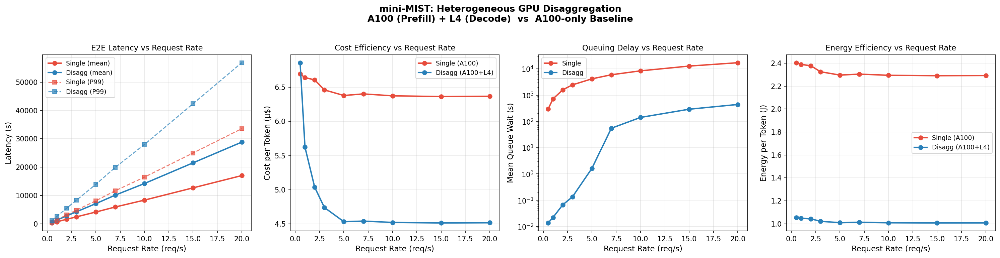

# mini-MIST: Heterogeneous GPU LLM Serving Simulator

A lightweight simulator for comparing **disaggregated prefill-decode serving** on heterogeneous GPUs (A100 + L4) against a single-GPU baseline (A100 only).

Inspired by the MIST framework ([arXiv:2504.09775](https://arxiv.org/abs/2504.09775)). Latency values are derived from the [GenZ](https://arxiv.org/abs/2406.01698) Roofline model for LLaMA-2 70B.

---

## Setup

No external dependencies required beyond Python 3.x standard library.

```bash
git clone https://github.com/jihyo-han/mini-mist.git
cd mini-mist
python simulator.py
```

---

## File Structure

| File | Description |
|------|-------------|
| `device_config.py` | GPU specs (A100, L4): price, TDP, prefill/decode latency per token derived from GenZ |
| `runtime_model.py` | Roofline-based latency model — maps (device, stage, input_len) → latency (sec) |
| `simulator.py` | Batch simulation + Poisson-arrival online simulation with queue modeling |
| `genz_extract.py` | Script used to extract latency values from GenZ outputs |
| `genz_results.csv` | Raw GenZ Roofline results for A100 and L4 |
| `plot_results.py` | Generates result graphs |
| `results.png` | Output graphs (E2E latency, cost/token, queue wait vs. request rate) |

---

## Simulation Modes

### Single (baseline)
- A100 handles both prefill and decode sequentially
- Requests queue until the GPU is free

### Disaggregated
- A100 handles prefill only
- L4 handles decode only
- Pipelined: decode starts immediately after prefill finishes on the next available GPU

---

## Key Results

At low request rates, disaggregated mode has slightly higher per-request latency due to heterogeneous GPU speeds. At higher request rates, disaggregated mode shows significantly lower queue wait times and ~25% cost reduction compared to the single A100 baseline.



---

## GPU Configuration

| GPU | Role | Price/hr | TDP | Prefill (sec/token) | Decode (sec/token) |
|-----|------|----------|-----|---------------------|--------------------|
| A100 | Prefill | $3.00 | 300W | 0.000337 | 0.033847 |
| L4   | Decode  | $1.20 | 72W  | 0.000434 | 0.059158 |

Latency values derived from GenZ Roofline model (LLaMA-2 70B, TP=2 for A100, TP=8 for L4).
